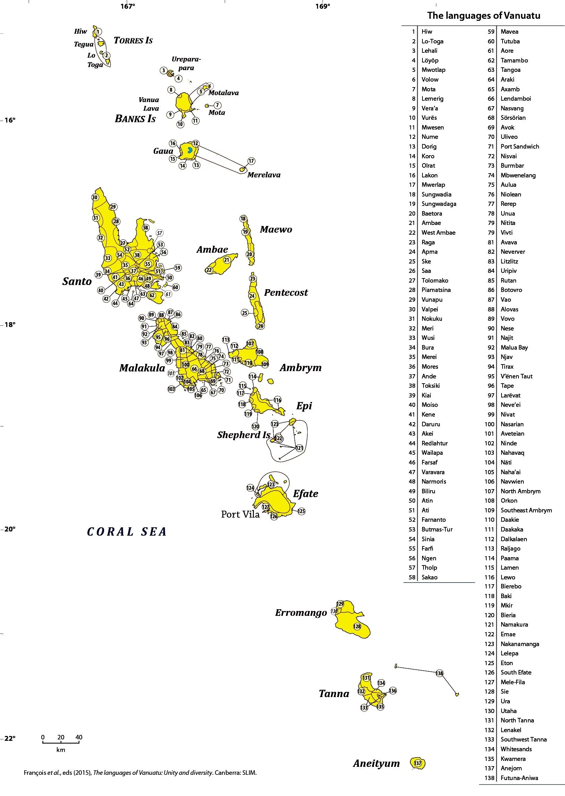
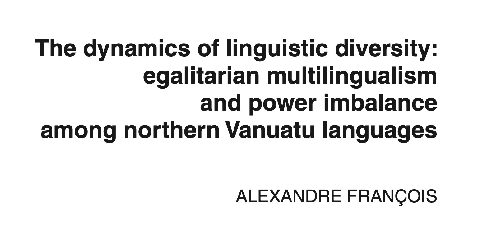
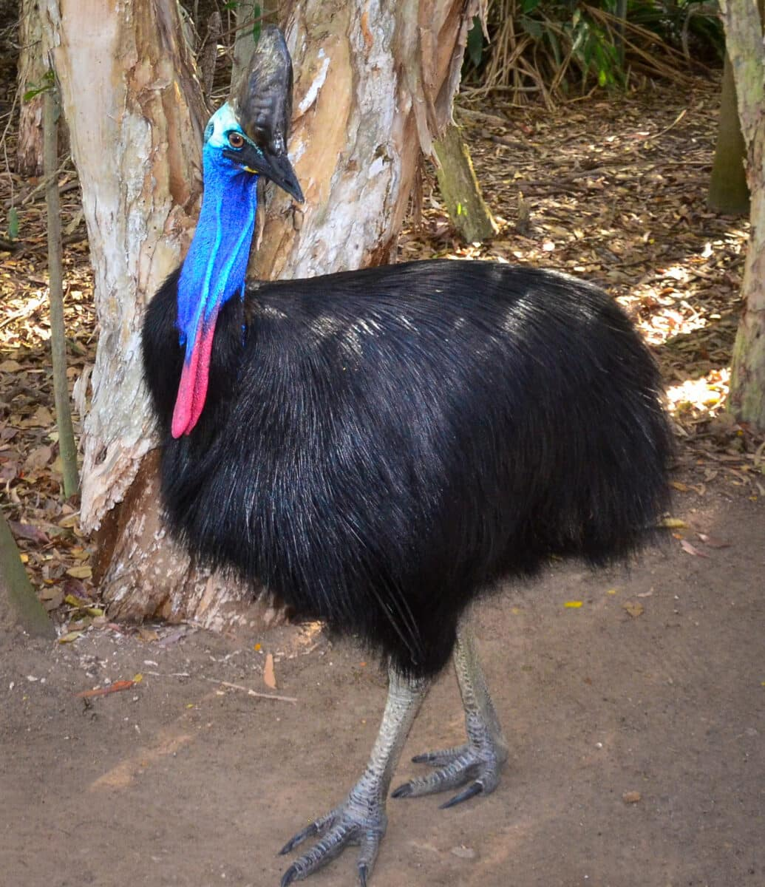
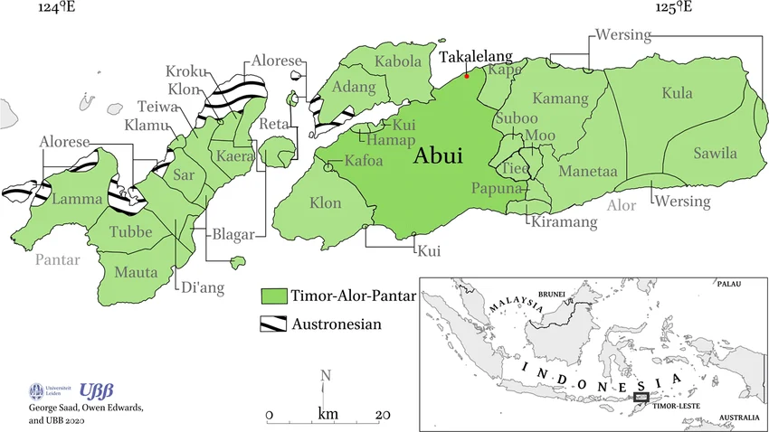

## Journal (5 min)

Choose one option and write silently. We'll hear from a couple of people afterward.

::: {.columns}
::: {.column width="50%"}
**Option A**

Have you ever noticed a group (a friend group, a team, your hometown) deliberately speaking differently from a neighboring group, almost as a way of saying "we're not them"? What did that look like?
:::
::: {.column width="50%"}
**Option B**

Describe a word or phrase that's specific to your family, hometown, or friend group — something an outsider wouldn't get. What would be lost if you stopped using it?
:::
:::

::: {.notes}
~5 min: 4 min silent writing, then 1-2 volunteers share.
:::

## Today's Plan

1. Activity: Research a Pacific Country
2. Your Discussion Questions
3. [Agenda item 3]
4. [Agenda item 4]

## Activity: Research a Pacific Country {.smaller}

**In your group:** research your assigned country/territory on Wikipedia or another reliable source. You have 8 minutes.

::: {.columns}
::: {.column width="50%"}
1. New Caledonia
2. Tonga
3. Federated States of Micronesia
:::
::: {.column width="50%"}
4. Indonesian Papua
5. Solomon Islands
6. French Polynesia
:::
:::

**Answer as a group:**

- How many indigenous languages does it have? What's your source?
- What's the metropolitan (colonial/official) language?
- Is there a pidgin, creole, or *lingua franca* used across language groups?
- Which of today's three factors best explains its level of diversity?
- Anything that doesn't fit the patterns we discussed today?

::: {.notes}
~8 min research time. Groups have laptops. Circulate while they work.
:::

## Compare and Constrast

1. **Report** Each Each group gives a 1-2 minute rundown of what they found — the numbers, the languages, and their factor hypothesis.
2. **Track it** As groups report, jot each one on the shared doc: indigenous language count, metropolitan language, pidgin/creole (y/n), best-fit factor.
3. **Look at the board** Once all six are up, look across the whole set together — what patterns jump out?

> **Discuss:** Which factor came up most often as the best explanation across the six? Did any country not fit neatly into the patterns from Tuesday?

::: {.notes}
~8 min research time. Groups have laptops. Circulate while they work.
:::

## [Three-Stat Example]

::: {.columns}
::: {.column width="33%"}
### [Number]
[caption]
:::
::: {.column width="33%"}
### [Number]
[caption]
:::
::: {.column width="33%"}
### [Number]
[caption]
:::
:::

# Your Discussion Posts

## From Your Discussion Posts

Great questions and connections came in on Chapter 7 — let's dig into a few.

::: {.notes}
Opening framing slide. Names the three threads we're pulling from student posts before diving into each.
:::

## {background-image="images/vanuatu_loc.png"}

## Vanuatu, Revisited {.smaller}

::: {.columns}
::: {.column width="50%"}
**Michael asked:** how can one small island group have languages so different that neighboring islands can't understand each other?

**Dyllan asked:** when a language is only spoken by a few hundred people and isn't being passed to kids, what happens next — and does losing the language mean losing parts of the culture?

> **Discuss:** What would it take for a language with a few hundred speakers to survive another generation?

:::
::: {.column width="50%"}

:::
:::

::: {.notes}
Tie back to Tuesday's three factors (time, separation, social structure) — Vanuatu is the extreme case of all three stacking together.

Dyllan's question, updated: Crowley (2000) famously argued Bislama posed no real threat to Vanuatu's indigenous languages. A 2025 review (Lavender Forsyth) challenges that — 2020 census data show only 14% of Vanuatu's population now speaks an indigenous language as their first language, and in rural areas as many as 1 in 5 people aged 4-20 have Bislama, not an indigenous language, as their first language. That's the mechanism behind Dyllan's question: kids growing up with Bislama at home instead of the local language breaks the chain of transmission. Don't over-explain this — just flag it, since full language endangerment is covered in a later unit.
:::

## Why So Many Languages? {.smaller}

::: {.columns}
::: {.column width="50%"}
Linguist Alexandre François has spent decades documenting this exact puzzle in northern Vanuatu (the Torres and Banks Islands).

- **17 languages, 9,400 people** — all descended from one ancestor language, 3,000 years of divergence
- **Isolation alone doesn't explain it** — people there are constantly in contact: trading, intermarrying, visiting
- **Language as identity marker:** communities *deliberately* keep their speech different from close, friendly neighbors — François calls this language's "emblematic function"
- **Egalitarian multilingualism:** no village outranks another, so no variety becomes "the" prestige language — everyone just learns their neighbors' languages instead
:::
::: {.column width="50%"}

> **Discuss:** If isolation alone doesn't explain Vanuatu's diversity, what does this suggest about places that *are* very isolated but still only have one language?
:::
:::

::: {.notes}
Direct answer to Michael's and Dyllan's questions, grounded in François (2011, 2012). Key reframe: diversity isn't an accident of geography, it's maintained on purpose. Also sets up Dyllan's endangerment question — the same egalitarian multilingualism that sustains tiny languages today is exactly what's eroding under colonial-era disruption and modern schooling (mention briefly, don't dive deep — save for later unit on endangerment).
:::

## Zooming Out: Is This Just Vanuatu? {.smaller}

- **Not unique to the Pacific:** linguists call this pattern "small-scale" or "egalitarian" multilingualism — the same setup (many small languages, no prestige hierarchy, everyone multilingual) is documented in West Africa, the Amazon, and northern Australia too (Lüpke 2016; Pakendorf, Dobrushina & Khanina 2021)
- **A bigger claim:** linguist Nicholas Evans (2018) argues this may be close to the *ancestral* human condition — that language itself likely evolved in multilingual small-scale societies, not isolated monolingual ones
- If he's right, multilingualism isn't the exception that needs explaining — monolingual nation-states are the historically recent, unusual case

> **Discuss:** If small-scale multilingualism was the human norm for most of history, why does monolingualism feel like the "default" to so many people today?

::: {.notes}
~5 min. Good note to end the Vanuatu thread on: reframes the whole unit. Monolingualism isn't neutral/natural — it's a product of nation-state language policy, mass schooling, and standardization, which is a much more recent development than multilingual small-scale societies. Don't need to resolve the discuss prompt — just let it sit before moving to Kale's question.
:::

## Language and Local Knowledge

**Kale's connection:** in BOT 444 (Ethnoecology), Kale has studied how Indigenous and Local Knowledge (ILK) develops over generations through a community's relationship with its environment — and noticed this tracks closely with how Lynch describes language diverging through geographic and social separation.

**Kale's question:** could neighboring language groups in Melanesia have different names, classifications, or knowledge systems for the same plants and animals?

> **Discuss:** If language and ecological knowledge both diverge through isolation, which one do you think usually changes first?

::: {.notes}
This is a strong interdisciplinary connection — worth explicitly praising in class. If no one has a confident answer to the discuss prompt, that's fine; the point is raising the possibility that linguistic diversity and biocultural diversity are entangled, not resolving it today.
:::

## Kale's Question, Globally {.smaller}

David Harmon (1996) compared the countries with the most endemic languages (found nowhere else) to the countries with the most endemic vertebrate species (mammals, reptiles, birds, amphibians found nowhere else).

- **64% overlap** between the top 25 countries on each list
- **Papua New Guinea ranks #1** for endemic languages (847) *and* in the top 10 for endemic vertebrate species
- His explanation: the same conditions — rugged terrain, isolation, small-scale societies — that let species diverge into new forms also let languages diverge into new forms. One doesn't cause the other; both are downstream of the same isolation

> **Discuss:** Harmon's explanation is about geographic *isolation* producing both effects in parallel. How does this compare to François's claim (from the Vanuatu slides) that language diversity is partly deliberate, not just a byproduct of isolation? Could both be true at once?

::: {.notes}
Answers Kale's question at the macro/statistical level: diversity of language and diversity of species co-occur geographically, worldwide, not just impressionistically in Melanesia. Harmon (1996), Southwest Journal of Linguistics. Good moment to have students hold two explanations in tension rather than picking one — isolation-as-shared-cause (Harmon) vs. deliberate differentiation (François) aren't mutually exclusive.
:::

## Example {.smaller}

A concrete case: the Kalam people of the Upper Kaironk Valley, Papua New Guinea highlands (~13,000 speakers).

::: {.columns}
::: {.column width="50%"}
**Zoology (Bulmer 1967):** Kalam classify cassowaries *separately* from all other birds — not by mistake, but because cassowaries occupy a unique role in Kalam thought and ritual. Their system also sorts animals by habitat (forest vs. garden vs. homestead; aerial vs. terrestrial vs. underground), not just by body shape the way Western biology does.

{width=50%}
:::
::: {.column width="50%"}
**Botany (Gardner 2010):** Kalam distinguish roughly 500 named plants — many finer-grained than Western scientific species, some grouping things Western botany splits apart.

> **Discuss:** Bulmer titled his paper "Why is the cassowary not a bird?" What does it tell us that this is a real, serious research question?

:::
:::

::: {.notes}
This is the direct, concrete answer to Kale's original question — yes, a documented Melanesian group has a classification system for plants/animals that diverges meaningfully from both Western science and (presumably) from neighboring groups, though a direct neighbor-to-neighbor comparison wasn't found in this search. Emphasize: Kalam taxonomy isn't "wrong" or "primitive" — it's organized around different, equally coherent criteria (ritual significance, habitat, practical use) rather than evolutionary descent.
:::

## This Research Is Happening Right Now {.smaller}

A 2024 PhD dissertation — from right here at UH Mānoa — documented exactly this kind of plant knowledge for the Abui people of Alor Island, eastern Indonesia (A.L. Blake, advised by Gary Holton). It's a direct, current answer to Kale's question about *how* a group actually classifies plants.

::: {.columns}
::: {.column width="50%"}
**Names encode different kinds of knowledge**, not just appearance:

- *al fiyaai* "nettlespurge," lit. "Islam candlenut" — two plants that look nothing alike, linked because both were burned for lamp oil; the name preserves *history*, not shape
- *fia beeka* "fern bad" — marks a fern as inedible, in contrast to "good" (edible) ferns — classification by *utility*
- *kupai meeting* "forest betel-vine" — classification by *habitat*
:::
::: {.column width="50%"}
**Metaphor drives the categories**, often from the body or animals:

- *kaai hawet* "Ziziphus," lit. "dog its teeth" (thorns)
- *wata muur* "pomelo," lit. "coconut citrus" (fruit size)
- *katiki* "Conyza," lit. "loincloth broke" (shredded-looking leaves)

> **Discuss:** Western botany classifies primarily by evolutionary descent. Abui plant names show at least five other organizing logics — history, utility, habitat, body-part metaphor, taxonomic prototype. Is any one of these more "correct" than the others?

:::
:::

::: {.notes}
This is the most direct, current answer to Kale's actual question. Good closing move on the Kale thread: shows this isn't settled 1960s-70s scholarship (Bulmer) — it's live research, happening now, at Andy's own institution, on a different island group from Vanuatu/PNG, reinforcing that this pattern isn't one-off. The "metaphor hardening into taxonomy" point (alokai example) is worth dwelling on — it shows folk classification isn't a fixed system handed down unchanged, it's actively being renegotiated as new plants and new generations enter the picture.
:::

## 

{width="150%"}

## Multilingualism as Identity

**Chloe's post:** growing up in Hawai'i with a Chinese family background, Chloe noticed she speaks differently depending on who she's talking to — English at school, another language at home — and connected this to why multilingualism is so common across the Pacific.

> **Discuss:** Think of a time you (or someone you know) switched languages or ways of speaking depending on who you were talking to. What triggered the switch?

::: {.notes}
~5-7 min. This personalizes the material — don't let it stay abstract. If the room is quiet, offer your own example first.
:::

## For Tuesday

- Quiz 2 closes **Friday, October 2 at 11:59pm**
- Read [Ch. 9 - The Languages of Micronesia](https://lamaku.hawaii.edu/content/enforced/176107-MAN.75669.202710-LING-150C/09_Languages_of_the_Pacific_Islands_Bender.pdf?isCourseFile=true&ou=176 107) (Bender) (13 pgs.)

- **Keep in mind:** Writing Assignment 1 First Draft due **Friday, October 9 at 11:59pm**

::: {.notes}
~4 min. Exit ticket, silent writing.
:::
