## Journal (5 min)

Choose one option and write silently. We'll hear from a couple of people afterward.

::: {.columns}
::: {.column width="50%"}
**Option A**

Think of a place you've lived whose everyday vocabulary — weather, food, directions, local slang — an outsider wouldn't fully get. What would you lose if you moved away from it?
:::
::: {.column width="50%"}
**Option B**

What do you know already about Micronesia? Think about its islands, peoples, languages, history, or anyone you know with connections there.

- Where did you learn it (school, family, media, travel)?
- What would you like to find out after reading Bender's chapter?
:::
:::

::: {.notes}
~5 min: 4 min silent writing, then 1-2 volunteers share.
:::

## Reminders

**Writing Assignment 1 Draft** is due this Friday, **October 9 at 11:59pm** 

**Office Hours**: Wednesdays/Fridays 1:30-2:30pm in Moore Hall 574 or on Zoom

- If you can't make that time, email me to set up a different time.

## Today's Plan

1. Introduction & geography of Micronesia
2. Countries & Territories of Micronesia
3. Relocate or Raise the Land?
4. Looking ahead to next week

## Just How Big Is Micronesia? {.smaller}

Bender's own way of putting it:

- Fly from Los Angeles to Hawai'i, then keep going the same distance again in the same direction — you'd land in Majuro, Marshall Islands, just past the International Date Line
- Crossing Micronesia east to west, from Majuro to Palau, is roughly the distance from New York to California — about 3,000 miles
- And most of what's in between is, as Bender puts it, barely specks on a map — this region's name literally means "small islands"

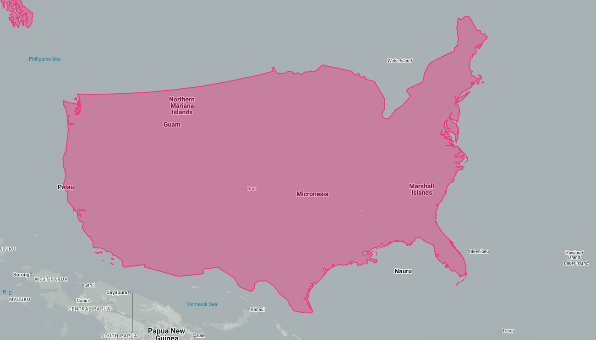{fig-alt="Map of the continental US and Micronesia, showing how far apart they are" width="60%" fig-align="center"}

::: {.notes}
Quick opening hook before the map. Helps students viscerally grasp that "Micronesia" isn't one tight cluster of islands, it's an area the size of the continental US, just almost entirely ocean.
:::

##

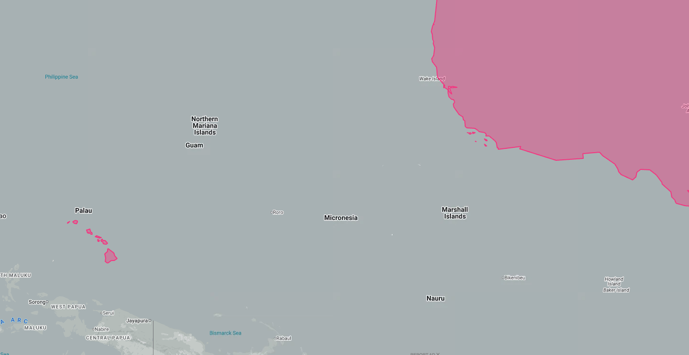{width="150%"}

## What Is a "Culture Area"? {.smaller}

::: {.columns}
::: {.column width="55%"}
Micronesia, Melanesia, and Polynesia — the three areas we've been using all semester — aren't geographic or political categories.

- They're defined by **indigenous peoples and their ways of living, including their languages** — not by neat boundaries on a map
- We'll see this complicate things today: Chamorro and Palauan aren't even Oceanic languages, and two *Polynesian* languages (Kapingamarangi, Nukuoro) are spoken deep inside Micronesia
- Keep an eye out for how often "which culture area is this?" and "which language family is this?" give different answers
:::
::: {.column width="45%"}
{fig-alt="Map of the Pacific showing the three culture areas: Micronesia, Melanesia, and Polynesia"}
:::
:::

## Living on a Life Raft {.smaller}

Almost 2 in 5 Micronesians live on <mark>**coral atolls**</mark> — a sliver of land, often under a mile wide, a few feet above sea level at most. That environment leaves a mark on the language.

::: {.columns}
::: {.column width="50%"}
**Atoll languages** are unusually rich in vocabulary for:

- Navigation, stars, and wayfinding
- Fishing methods, canoe parts and sailing
- Coconut, breadfruit, and pandanus cultivation

:::
::: {.column width="50%"}
**High-island languages** are richer instead in:

- Names for flora and fauna
- Topographical features (ridges, valleys, streams)
:::
:::

When atoll families resettle on high islands — Mortlock Islanders on Pohnpei, Satawal Islanders on Saipan — their children often stop acquiring that specialized atoll vocabulary within a generation or two.

> **Discuss:** If you grew up on a high island and moved to an atoll (or vice versa), what vocabulary do you think would be hardest to pick up?

::: {.notes}
This is the richest unused material in the chapter and connects directly back to Kale's ecology question and the Abui classification material from Tuesday — language tracks environment, and that knowledge is genuinely fragile across a single generation of relocation.
:::

##

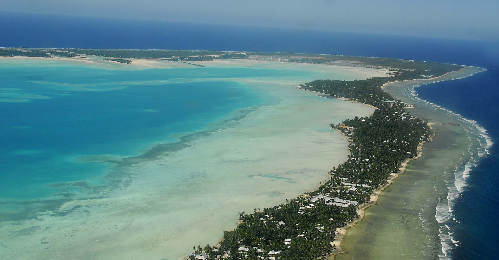

##

::: {.columns}
::: {.column width="50%"}
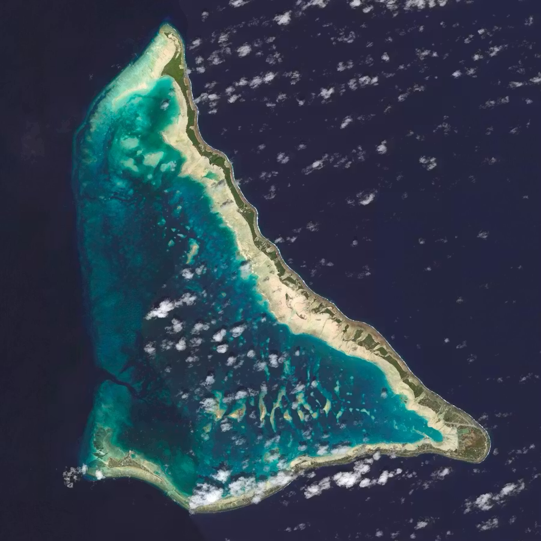{fig-alt="Tarawa Atoll" width="60%"}
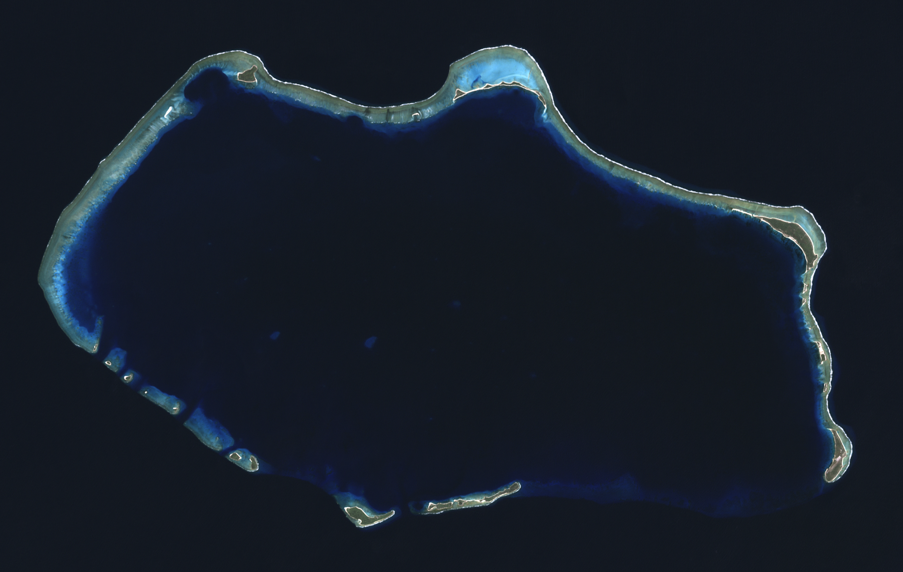

:::
::: {.column width="50%"}
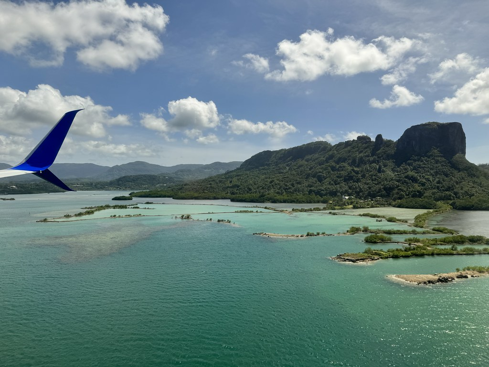
:::
:::

## Quick Activity: Sort the Languages {.smaller}

From Bender's chapter, you've met these eight languages:

**Chamorro · Palauan · Yapese · Marshallese · Pohnpeian · Kosraean · Nauruan · Kiribati**

**In pairs, 3 minutes:** sort them into three groups, and be ready to explain your reasoning.

1. **Not Oceanic at all**
2. **Oceanic, but not Nuclear Micronesian**
3. **Nuclear Micronesian**

::: {.notes}
Retrieval from the reading, before the tour. Cold-call 2-3 pairs, then reveal the answer on the next slide. Keep this to about 3-4 minutes total.
:::

## Sort the Languages: Answers {.smaller}

::: {.columns}
::: {.column width="30%"}
**Not Oceanic**

- Chamorro
- Palauan

*First wave out of Taiwan, with the Philippines and Indonesia*
:::
::: {.column width="30%"}
**Oceanic, not Nuclear Micronesian**

- Yapese

*An early, separate branch of Oceanic*
:::
::: {.column width="40%"}
**Nuclear Micronesian**

- Marshallese
- Pohnpeian
- Kosraean
- Nauruan
- Kiribati

*One shared ancestor, Proto-Micronesian*
:::
:::

::: {.notes}
Common misses: students put Chamorro/Palauan in Nuclear Micronesian because they're in Micronesia, or Yapese with the other FSM languages because it's in the FSM. Use that to preview the "culture area vs. language family" point: geography and language family don't line up. Nauruan is Nuclear Micronesian but its position within the group is unclear (Bender: likely its own top-level branch).
:::

# Countries & Territories of Micronesia

## Guam & the Northern Mariana Islands  🇬🇺 🇲🇵 {.smaller}

**Chamorro** — not part of the Oceanic subgroup we've been discussing

::: {.columns}
::: {.column width="60%"}
- Settled from the Philippines around 1500 BC — one of the longest open-ocean voyages (1,300 mi.) in the entire Austronesian expansion, until Polynesians later crossed even farther
- Belongs to the *first* wave of Austronesian migration out of Taiwan, the same wave that settled the Philippines and Indonesia — a completely separate branch from the Oceanic languages of Melanesia/Polynesia we've covered so far
- On Saipan (NMI) today, many residents instead speak **Carolinian** — descended from more recent Chuukic-area settlers, and bilingual with their Chamorro neighbors
:::
::: {.column width="40%"}
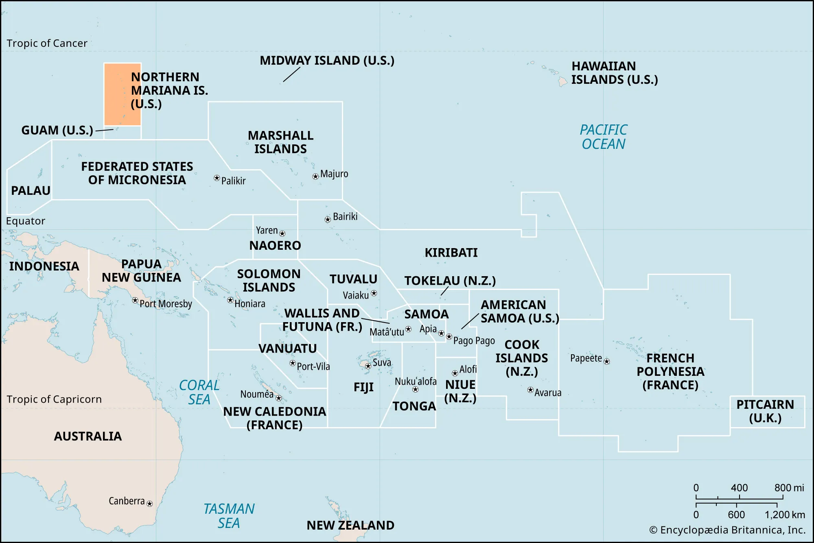

:::
:::

::: {.notes}
Good opening move: most students will assume "Pacific Islander language" = Oceanic by default. Chamorro breaks that pattern immediately and is worth flagging explicitly.
:::

## Chamorro: Two Ways to Count {.smaller}

Chamorro has **two number systems** side by side:

| | Native Chamorro | Spanish-derived |
|---|---|---|
| 1 | håcha | uno |
| 2 | hugua | dos |
| 3 | tulu | tres |
| 4 | fatfat | kuåtro |
| 5 | lima | sinko |

- The native numbers are Austronesian to the core — compare *hugua* 'two' and *lima* 'five' with Malay *dua*, *lima* and Hawaiian *lua*, *lima*
- The Spanish set is typically used for money, time, and ages

**The Spanish layer:** Spain colonized the Marianas from the 1600s until 1898, and left a heavy imprint on Chamorro vocabulary — days of the week, much of the Catholic vocabulary, and everyday words. *Si Yu'os ma'åse'* ("thank you") literally means "God have mercy."

> **Discuss:** Why might a language keep *both* a native and a borrowed set of numbers, and use them for different jobs?

::: {.notes}
Spanish numbers are used for money, time, and age; the native set is used in other counting contexts. Verify spellings/diacritics with a Chamorro speaker or the Chamorro Language Commission before class. Sets up the Marshallese/Bislama language-contact discussion later.
:::

## Palau 🇵🇼 {.smaller}
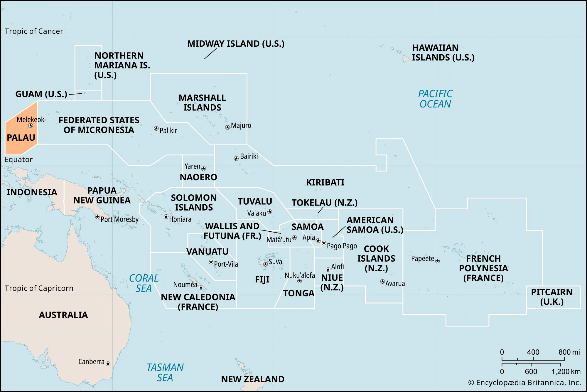

## Palau 🇵🇼 {.smaller}

::: {.columns}
::: {.column width="60%"}
**Palauan** — also outside the Oceanic subgroup, like Chamorro, but its migration route is much less certain than Chamorro's

- Six remote outer atolls of Palau (Sonsorol, Pulo Anna, Merir, Tobi) speak a totally different, unrelated language: **Sonsorol-Tobi**, actually part of the Chuukic group tied to Yap State — a reminder that national borders and language families don't line up
- Historical link to Yap: Yapese stone money ("rai") was literally quarried *in* Palau, and Yapese has a number of Palauan loanwords from that contact
:::
::: {.column width="40%"}
{fig-alt="Ancient Yapese stone money (rai), quarried in Palau"}

::: {style="font-size: 0.5em; text-align: center;"}
Yapese stone money (rai)
:::
:::
:::

## Palauan: The Japanese Layer {.smaller}

Just as Spanish left its mark on Chamorro, **Japanese** left its mark on Palauan.

::: {.columns}
::: {.column width="55%"}
- Japan administered Palau from 1914 to 1944 and introduced Japanese-language schooling right away
- Hundreds of Japanese loanwords entered everyday Palauan (one study counts 850+), and many are still in use today, though fewer than a generation ago
- Japanese rule also brought **surnames** into common use — civil records like birth certificates, marriage licenses, and inheritance required them
- Fun fact: the state of Angaur's constitution has recognized Japanese as an official language, alongside Palauan and English
:::
::: {.column width="45%"}
| Palauan | Meaning | Japanese |
|---|---|---|
| *sensei* | teacher | *sensei* |
| *bento* | food eaten away from home | *bentō* |
| *dengki* | electricity | *denki* |
| *dengua* | telephone | *denwa* |
| *simbung* | newspaper | *shinbun* |
| *skoki* | airplane | *hikōki* |
| *sidosia* | car, automobile | *jidōsha* |
| *iakiu* | baseball | *yakyū* |
:::
:::

> **Discuss:** Chamorro has a Spanish layer, Palauan has a Japanese layer. What does this tell us about how a colonial language's imprint depends on who ruled, for how long, and through what institutions (schools, government, church)?

::: {.notes}
Compare directly with the Chamorro "Spanish layer" note: different colonizer, different institutional channel (church vs. schooling/civil administration). Sources: Long & Imamura, "The Japanese Language in Palau"; "The Changes in the Use of Japanese Loanwords in Palauan" (J-STAGE). The Angaur detail is widely reported — double-check wording before class if you want to state it precisely. Loanword spellings and glosses are from the New Palauan–English Dictionary (Josephs 1990), as compiled at faroutliers.com; the Japanese source forms are my own matching. Notice how many are modern technology and institutions (electricity, telephone, newspaper, airplane, car), plus baseball. Palauan orthography: ng = velar nasal, ch = glottal stop. If the slide overflows, drop a row or two from the table.
:::

## Listen: Palauan {.smaller}



[Oluchel speaking Palauan](https://wikitongues.org/videos/oluchel_20160824_pau/) — Wikitongues language archive

::: {.notes}
Embedded directly from Wikitongues' YouTube video. A nice way to let students actually hear the language we've been talking about in the abstract.
:::

## FSM 🇫🇲 {.smaller}
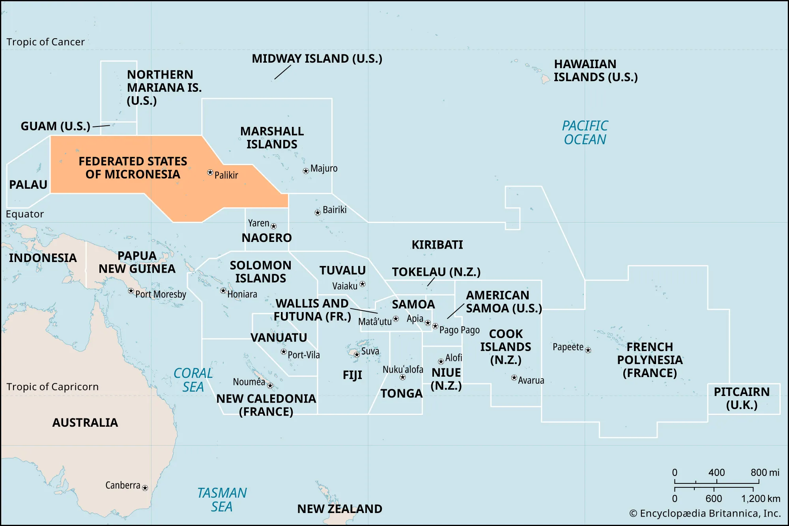

## FSM 🇫🇲 {.smaller}

The Federated States of Micronesia is four states, each with its own language — and those four languages fall into *two* very different linguistic categories.

::: {.columns}
::: {.column width="50%"}
**Yapese** stands alone — an early, separate branch of Oceanic (~1400 BC), not part of the "Nuclear Micronesian" group the other three belong to.
:::
::: {.column width="50%"}
**Chuukese, Pohnpeian, and Kosraean** are all **Nuclear Micronesian** — descended from one shared ancestor, Proto-Micronesian, that spread out from the eastern end of Micronesia.
:::
:::

{fig-alt="Map of Micronesian language distribution" width="55%" fig-align="center"}

::: {.notes}
Set up the two sub-threads before diving into states individually: (1) Yap is the outlier, (2) the other three share deep common ancestry. This primes the Chuukic-continuum material coming up under Chuuk.
:::

## Yap {.smaller}

::: {.columns}
::: {.column width="60%"}
**Yapese** stands alone among the FSM's languages — possibly linked to the Admiralty Islands, not part of "Nuclear Micronesian" at all.

- The high island of Yap has historically provided famine relief to its surrounding atolls (Ulithi, Woleai, etc.) during typhoons — a tribute relationship sometimes called the **Yap Empire**
- Those outer-atoll languages (Ulithian, Woleaian, Satawalese, and others) are actually part of the **Chuukic continuum** — more on that next
:::
::: {.column width="40%"}
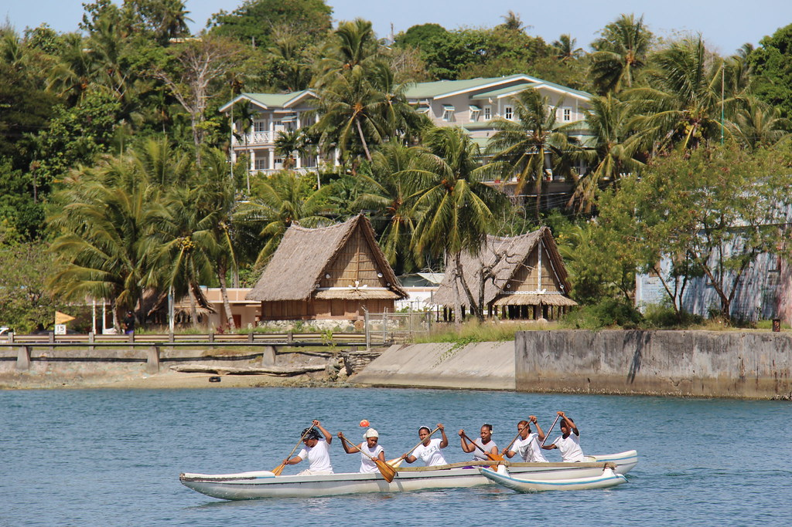
:::
:::

## Chuuk {.smaller}

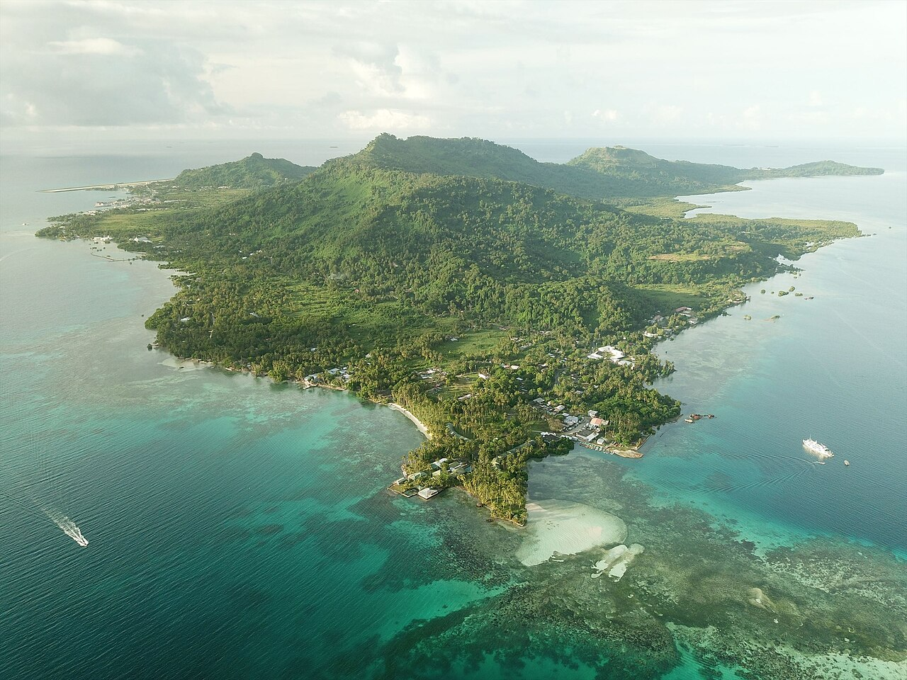

## Chuuk {.smaller}

A great real-world test of the "language limit" idea from Week 5 (Cook, cognates): **roughly 70% shared basic vocabulary is the rough cutoff between "dialect" and "different language."**

::: {.columns}
::: {.column width="55%"}
Cognate percentages across six related Chuukic varieties (Bender 1971):

| | Son. | Uli. | Wol. | Sat. | Pul. |
|---|---|---|---|---|---|
| Ulithi | 68.8 | | | | |
| Woleai | 59.4 | 74.1 | | | |
| Satawal | 57.5 | 65.5 | 77.1 | | |
| Puluwat | 58.0 | 63.6 | 67.5 | 79.9 | |
| Chuuk | 55.4 | 56.6 | 57.7 | 64.4 | 75.4 |
:::
::: {.column width="45%"}
Neighboring pairs hover right around that 70% line — classic dialect continuum. Pairs farther apart on the chain drop well below it.
:::
:::

> **Discuss:** Given these numbers, is it more accurate to say Chuukic is "six languages" or "one language with six dialects"? Does the question even have a clean answer?

::: {.notes}
This is the strongest connective-tissue moment in the whole deck — ties directly back to the cognates/comparative method unit from two weeks ago. Worth slowing down here rather than rushing through.
:::

## Pohnpei {.smaller}

::: {.columns}
::: {.column width="60%"}
- **Pohnpeian** is part of the Pohnpeic branch of Nuclear Micronesian, with its own satellite atoll languages (Mokilese, Pingilapese, Ngatikese)
- Two unrelated **Polynesian Outlier** languages — Kapingamarangi and Nukuoro — are also spoken in Pohnpei State, despite being geographically deep in Micronesia. Their speakers arrived via Tuvalu around 1000 AD
- Nan Madol — the massive stone ruins on Pohnpei — may be linked to the rise of an early, breadfruit-fueled Micronesian society
:::
::: {.column width="40%"}
{fig-alt="Basalt ruins of Nan Madol, Pohnpei"}

::: {style="font-size: 0.5em; text-align: center;"}
Nan Madol ruins, Pohnpei
:::
:::
:::

> **Discuss:** Kapingamarangi and Nukuoro are Polynesian languages spoken in Micronesia. What does that tell us about the difference between a geographic region and a linguistic one?

## Kosrae 

::: {.columns}
::: {.column width="50%"}
- Kosraean may be the closest thing to a "homeland" for all of Nuclear Micronesian — genetic-tree evidence (Ross 1996) points to Kosrae as the likely point of origin
- It's the only *high island* among the four easternmost points of Micronesia (with Nauru, northern Kiribati, and the southern Marshalls) — more land, fresh water, and room for sustained settlement than an atoll offers
- Lelu, Kosrae's own set of stone ruins, parallels Nan Madol on Pohnpei
:::
::: {.column width="50%"}
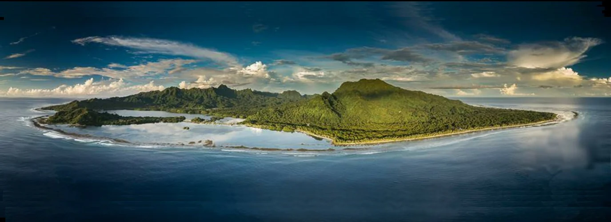
:::
:::

## Marshall Islands 🇲🇭 {.smaller} 
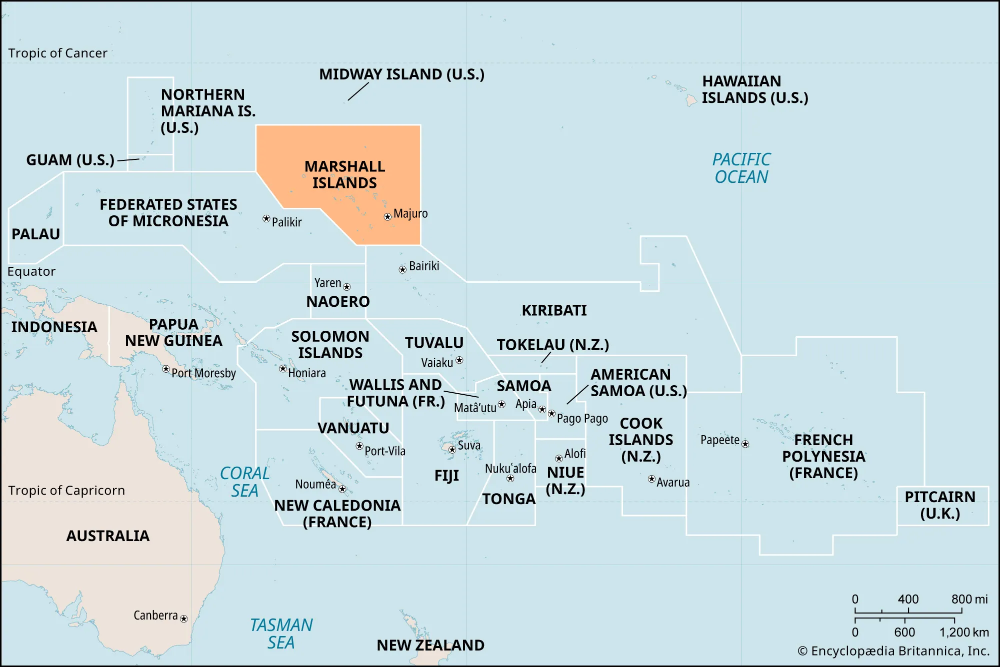

## Marshall Islands 🇲🇭 {.smaller} 

Bender uses **Marshallese** as the chapter's showcase for Nuclear Micronesian grammar — a few standout features:

::: {.columns}
::: {.column width="62%"}
- **Two words for "we"**, depending on whether the listener is included or not (inclusive vs. exclusive)
- An elaborate demonstrative system layered on person ("close to me" vs. "close to you" vs. "close to someone else") *and* human/nonhuman distinctions
- Directional suffixes that fuse onto verbs for compass directions, sea vs. land, even "toward the lagoon" vs. "toward the ocean side"
:::
::: {.column width="38%"}
{fig-alt="Marshallese stick chart used for wave and current navigation"}

::: {style="font-size: 0.5em; text-align: center;"}
Marshallese stick chart (directional/wave navigation)
:::
:::
:::

A Marshallese language commissioner, writing to Bender about the capital Majuro, describes watching Marshallese (**Kajin Ṃajeḷ**, "KM") lose ground to English (**Kajin Pālle**, "KP") in real time: code-mixed parliamentary debates, kids raised in English when one parent isn't Marshallese, phone numbers given in English even by people who know the Marshallese words, DVDs flooding households with English.

> **Discuss:** The commissioner calls this "the beginning of the demise of KM." Compare this to what we discussed last class about Bislama and Vanuatu's indigenous languages — same mechanism, different island group?

::: {.notes}
This quote is genuinely moving in context — consider reading it aloud rather than summarizing. Strong bridge back to Tuesday's Vanuatu/Bislama material and the Abui semantic-convergence slide; same underlying process (urbanization, a dominant contact/colonial language, generational break in transmission) recurring across completely different parts of the Pacific.
:::

## Nauru (Naoero) 🇳🇷 {.smaller}
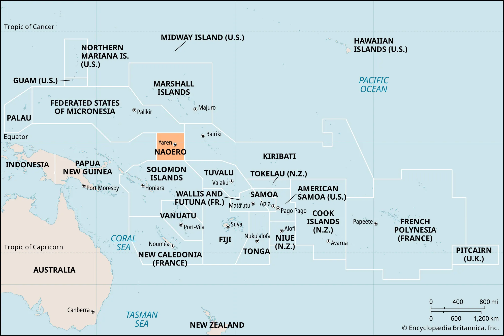

## Nauru (Naoero) 🇳🇷 {.smaller}

- The world's smallest independent nation — just 8 sq. mi.
- **Nauruan** is Nuclear Micronesian, but highly distinct from its nearest relatives — had it been included in the 2003 Proto-Micronesian reconstruction study, it likely would have formed its own top-level branch, just like Kosraean, Marshallese, and Kiribati each do
- Together, Nauru, Kosrae, the southern Marshalls, and northern Kiribati form a roughly 500-mile "quadrilateral" that's the best candidate for where Nuclear Micronesian first took root

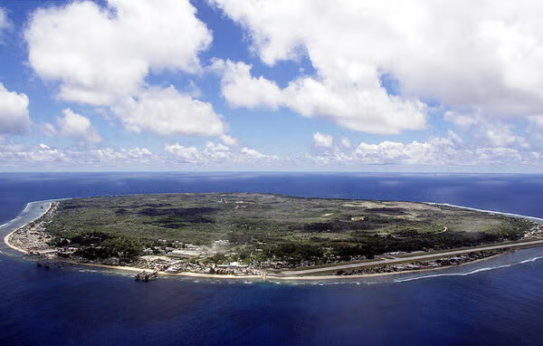

## Kiribati 🇰🇮 {.smaller}
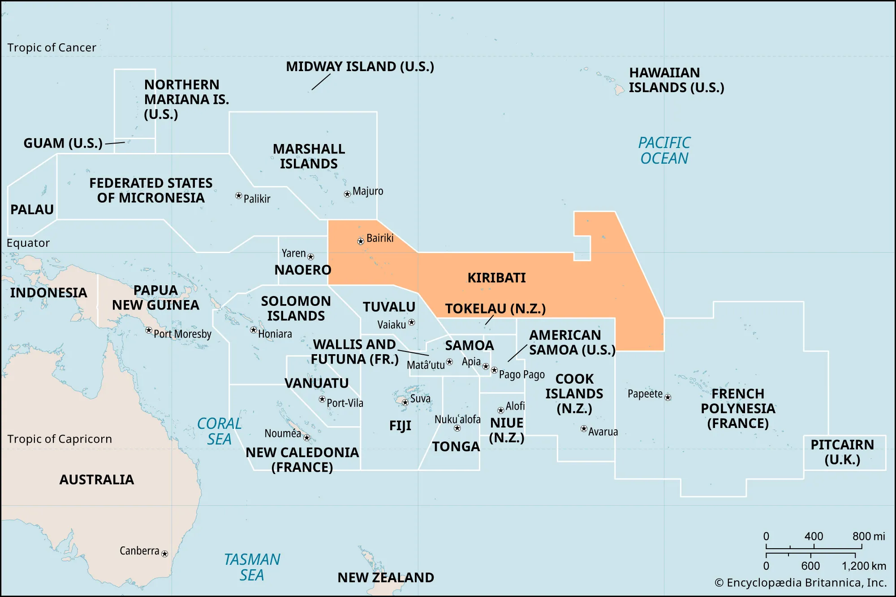

## Kiribati 🇰🇮 {.smaller}

- Likely the **first landfall** of the Nuclear Micronesian migration out of the southeast Solomons — a 1,100-mile voyage, around 3,000 years ago
- Entirely atolls — no point in the country rises more than 33 ft. above sea level
- A live, current existential threat: when Bender wrote this chapter, Kiribati had purchased land in Fiji and President Anote Tong was framing eventual relocation as **"migration with dignity."**
- Kiribati's current president, Taneti Maamau (reelected 2024), has taken the opposite approach: rather than planning to relocate, his government is pursuing large-scale land reclamation and dredging — physically raising and expanding the islands, backed by Chinese aid — to stay in place
- Either way — relocating or raising the land — much of the atoll-specific vocabulary (navigation, fishing, canoe parts, star names) is tied to a way of life that's already under pressure

> **Discuss:** Two very different responses to the same threat — leave, or raise the land. What might each one mean for the long-term survival of the language?

::: {.notes}
Updated from Bender's original framing: Tong's "migration with dignity" was the policy in place when the chapter was written, but Maamau has since reversed course. Good moment to note that even a 2012-ish chapter can go out of date on fast-moving political material — model that kind of source-checking for students.
:::

## Activity: Relocate or Raise the Land? (12 min) {.smaller}

**Form groups of 4.** Each group is assigned a side (split the room in half):

::: {.columns}
::: {.column width="50%"}
**Team Relocate**

Kiribati should plan for "migration with dignity" — resettle its people abroad over time.
:::
::: {.column width="50%"}
**Team Raise the Land**

Kiribati should stay: dredge, reclaim, and raise the islands.
:::
:::

**Your job (6 min):** make the best case for your side using **language and culture survival** as your main criterion. Draw on today's slides:

- Atoll vocabulary tied to a way of life (*Living on a Life Raft*)
- Marshallese in Majuro vs. Springdale, Arkansas
- Carolinian on Saipan; Mortlock Islanders on Pohnpei

**Then (6 min):** pair with a group from the *other* side. Each side gets 90 seconds, then you try to find one point of agreement.

::: {.notes}
Timing: ~1 min set-up, 6 min prep, 6 min cross-group pairing, ~3 min whole-class debrief (total about 12-15 min). Debrief questions: What did each side have to assume about language survival? Does a language need a place? Who gets to decide, and who was left out of the policy debate? Remind students this is a live political question for real communities, so aim for good-faith argument, not mockery. Tie directly into the exit ticket right after. A source worth having handy: coverage of Maamau's land-reclamation plans and Tong's "migration with dignity" (the Kiribati slide above already summarizes both).
:::

## Modern-Day Pressures {.smaller}

Across all of Micronesia, the same underlying forces are reshaping language use, regardless of which specific islands or languages are involved:

- Rapid **urbanization** — Majuro, Koror, Weno, Kolonia — pulls people off outer islands and atolls into crowded town centers
- A **cash economy** replaces subsistence fishing/farming, and with it, the specialized vocabulary tied to those practices
- English spreads through schooling, media, and intermarriage, often becoming the de facto home language for the next generation
- The US military presence at **Kwajalein** (Marshall Islands) is its own distinct pressure — a missile testing range that has reshaped Marshallese land use and labor for decades

::: {.notes}
Synthesis slide pulling together Bender's §8 "Modern-Day Micronesia" material — meant to generalize the Marshallese KM/KP story so students see it as a regional pattern, not a one-off.
:::

## The Compact of Free Association (COFA) {.smaller}

The FSM, the Marshall Islands, and Palau are independent nations, but each has a **Compact of Free Association** with the US — not colonies, but closely bound by treaty.

- Citizens of all three can live, work, and study in the US without a visa — this is why Micronesian communities exist across the US mainland and Hawai'i
- COFA funding was **renewed in 2024**: $7.1 billion over 20 years ($3.3B to FSM, $2.3B to RMI, $889M to Palau). Separately, Medicaid eligibility for COFA citizens living in the US was restored by Congress in December 2020, after being cut off by the 1996 welfare reform law
- This free-movement relationship is a major driver of the diaspora communities we're about to look at

## The Marshallese Diaspora: Springdale, Arkansas {.smaller}

- Springdale is now home to an estimated **12,000-15,000 Marshallese residents** — the largest Marshallese community outside the Marshall Islands themselves
- Drawn originally by poultry-industry jobs, enabled by COFA's visa-free travel
- The community has built real institutional infrastructure: more than 30 Marshallese churches, a Marshallese-language radio station, and an RMI consulate — the only one in the continental US
- An open question for a diaspora this size: does that infrastructure make it *easier* to maintain Kajin Ṃajeḷ across generations than it's been in Majuro itself, where English pressure is also intense?

> **Discuss:** Compare Springdale to the Chamorro/Carolinian bilingualism on Saipan, or to the KM/KP situation in Majuro. Does moving *away* from the homeland always mean faster language loss — or could it sometimes mean the opposite?

::: {.notes}
Deliberately leaves this open — there's a real research question here about whether concentrated diaspora communities with their own institutions can sometimes outperform the homeland at heritage-language maintenance. Good forward pointer to Week 11 (language endangerment/maintenance).
:::

## Closer to Home: Micronesians in Hawai'i {.smaller}

Hawai'i is home to a large COFA migrant community — and the discrimination against it is well documented.

- A 2019 U.S. Commission on Civil Rights report found Micronesian migrants face substantial barriers to housing, employment, healthcare, and education in Hawai'i — including landlords who refuse to rent to them and employers who won't hire them
- **Health coverage:** the 1996 federal welfare reform law cut COFA migrants off from Medicaid. Around 2010 Hawai'i moved them to a more limited state-funded plan, and in 2014 the Ninth Circuit (*Korab v. Fink*) held the state wasn't required to make up the lost federal funding. Congress only restored Medicaid eligibility in December 2020
- **COVID-19:** Pacific Islanders (a category that includes Micronesians) were about 5% of Hawai'i's population but about 22% of cases from March 2020 to February 2021 — an infection rate roughly 4.8 times the state average (7,070 vs. 1,477 per 100,000)
- UH Mānoa's own Thompson School of Social Work has studied discrimination directly, documenting Micronesians being stereotyped in local public discourse as "dirty," "uneducated," or a drain on the healthcare and welfare systems — stereotypes not supported by the data on actual service use

> **Discuss:** We've spent today's class treating Micronesian languages and peoples as subjects of academic study. What's it like to realize this community's everyday experience, here in the state where many of us live, includes this level of bias?

::: {.notes}
Deliberately placed right after the Springdale/COFA material, in the "closer to home" slot — this is not a distant case study, it's happening in Honolulu and across the state where (presumably) most students live. Handle with care: name the documented facts (the 2019 USCCR report, the *Korab v. Fink* Medicaid case, the COVID-19 case data, the UH Mānoa study). Note the COVID figures are for all Pacific Islanders, not Micronesians alone; Hawai'i DOH and the 2021 Hawai'i Advisory Committee report discuss COFA migrants specifically, including that Micronesians were overrepresented among cases and in COVID-order arrests. Likely contributing factors reported: crowded multigenerational housing, frontline jobs (hotels, airport, food service), and limited insurance access rather than generalizing about "Hawai'i locals" as a monolith, and don't let the discussion collapse into guilt — the aim is awareness and connecting it back to the language-vitality themes from the rest of the lecture (the same communities whose languages we just spent an hour on are the ones facing this). If any FAS/Micronesian students are in the room, be mindful they may have lived experience here — don't put anyone on the spot to represent "the community."
:::

## Exit Ticket (4 min)

Write silently; we'll collect these on the way out.

> If your family or community had to relocate entirely to a new country, what part of your language or culture do you think would survive the move, and what might not?

::: {.notes}
~4 min, silent writing. Direct callback to today's Kiribati relocation discussion and the Springdale diaspora slide — personalizes the same question Kiribati and Marshallese communities are actually facing.
:::

## For Thursday

- Read [Ch. 10 - The Languages of Polynesia](https://lamaku.hawaii.edu/content/enforced/176107-MAN.75669.202710-LING-150C/10_Languages_of_the_Pacific_Islands_Schutz.pdf?isCourseFile=true&ou=176107) (Schütz) (15 pgs.)
- Writing Assignment 1 First Draft **due Friday, October 9 at 11:59pm**
- Quiz #3 **opens Friday, October 9** and closes Monday, October 12 at 11:59pm

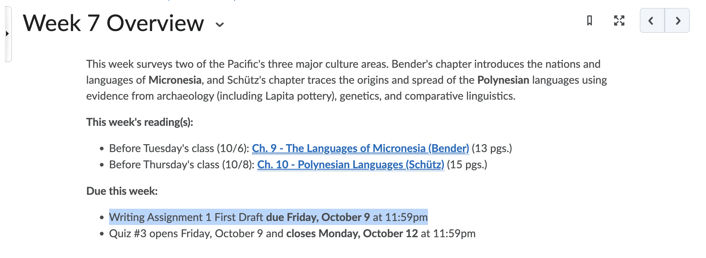
